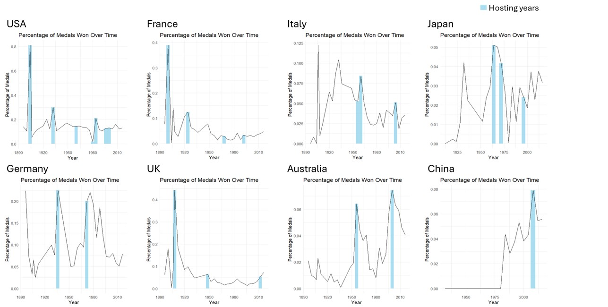

# Olympic Gold: Predicting 120 Years of Medal Glory  🏅
Ever wondered what it takes for a country to dominate the Olympics? Is it all about having a big GDP, a huge population, or just a knack for synchronized swimming? In this project, we dive into 120 years of Olympics data to figure out what makes a country rack up the medals. 

This project explores 120 years of Olympics data to predict the number of medals a country will win using a linear regression model. By combining historical Olympics data with socioeconomic indicators, we aim to uncover the key factors that influence medal counts and identify trends in national performance.

## Objectives
- Build a linear regression model to predict the number of medals a country will win.
- Identify key predictors such as GDP, population, and number of participants.
- Explore the impact of hosting the Olympics on a country's medal performance.
- Visualize trends in medal distribution and highlight countries that overperform or underperform relative to expectations.

### The Hosting Advantage: Fact or Fiction?
One of the most fun parts of this project was exploring whether hosting the Olympics makes you a medal magnet.

## Data Sources
- **Olympics Dataset (Kaggle: https://www.kaggle.com/datasets/heesoo37/120-years-of-olympic-history-athletes-and-results)**: 120 years of Olympics data, including athletes, events, and results.
- **Supplementary Socioeconomic Data**:
  - GDP and GDP per capita (World Bank).
  - Population (World Bank).
  - Host country details (manually created from Wikipedia).